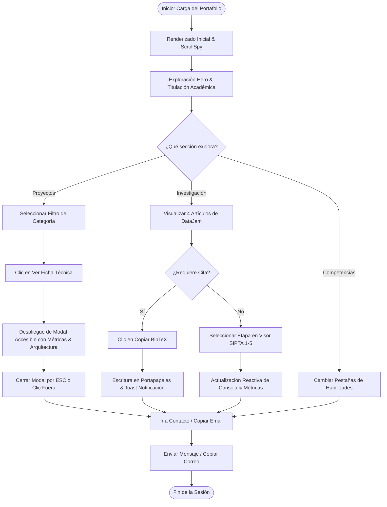

# Diagrama de Actividad — Flujo Principal de Exploración (Mermaid)
**Fase PDCO**: PLAN | **Estándar**: SWEBOK v3 / UML 2.5

```mermaid
flowchart TD
    Start([Inicio: Carga del Portafolio]) --> RenderInit[Renderizado Inicial & ScrollSpy]
    RenderInit --> ViewHero[Exploración Hero & Titulación Académica]
    
    ViewHero --> Choice{¿Qué sección explora?}
    
    Choice -->|Proyectos| FilterProjects[Seleccionar Filtro de Categoría]
    FilterProjects --> ClickProject[Clic en Ver Ficha Técnica]
    ClickProject --> OpenModal[Despliegue de Modal Accesible con Métricas & Arquitectura]
    OpenModal --> CloseModal[Cerrar Modal por ESC o Clic Fuera]
    
    Choice -->|Investigación| ViewPapers[Visualizar 4 Artículos de DataJam]
    ViewPapers --> BibtexChoice{¿Requiere Cita?}
    BibtexChoice -->|Sí| CopyBibtex[Clic en Copiar BibTeX]
    CopyBibtex --> ToastNotify[Escritura en Portapapeles & Toast Notificación]
    BibtexChoice -->|No| InteractVisor[Seleccionar Etapa en Visor SIPTA 1-5]
    InteractVisor --> UpdateConsole[Actualización Reactiva de Consola & Métricas]
    
    Choice -->|Competencias| SwitchTabs[Cambiar Pestañas de Habilidades]
    
    CloseModal --> Contact[Ir a Contacto / Copiar Email]
    ToastNotify --> Contact
    UpdateConsole --> Contact
    SwitchTabs --> Contact
    
    Contact --> SubmitMsg[Enviar Mensaje / Copiar Correo]
    SubmitMsg --> EndNode([Fin de la Sesión])
```
