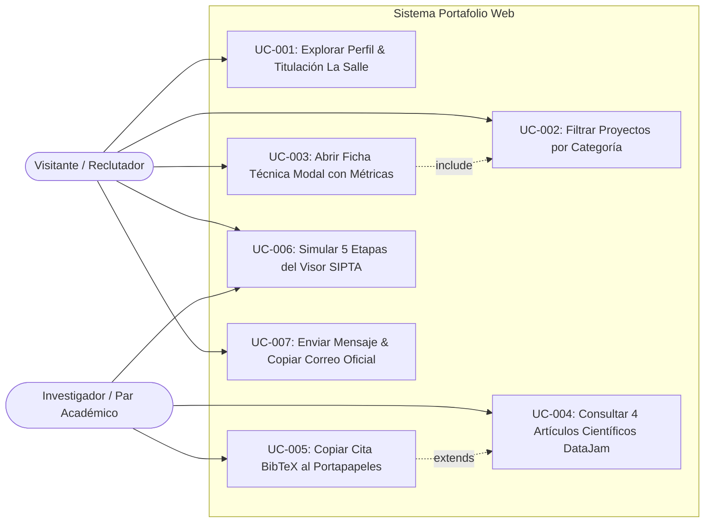

# Diagrama UML de Casos de Uso (Mermaid)
**Fase PDCO**: PLAN | **Estándar**: SWEBOK v3 / IEEE 830

```mermaid
graph LR
    User([Visitante / Reclutador])
    Researcher([Investigador / Par Académico])
    
    subgraph Sistema Portafolio Web
        UC1[UC-001: Explorar Perfil & Titulación La Salle]
        UC2[UC-002: Filtrar Proyectos por Categoría]
        UC3[UC-003: Abrir Ficha Técnica Modal con Métricas]
        UC4[UC-004: Consultar 4 Artículos Científicos DataJam]
        UC5[UC-005: Copiar Cita BibTeX al Portapapeles]
        UC6[UC-006: Simular 5 Etapas del Visor SIPTA]
        UC7[UC-007: Enviar Mensaje & Copiar Correo Oficial]
    end
    
    User --> UC1
    User --> UC2
    User --> UC3
    User --> UC6
    User --> UC7
    
    Researcher --> UC4
    Researcher --> UC5
    Researcher --> UC6
    
    UC3 -.->|include| UC2
    UC5 -.->|extends| UC4
```
