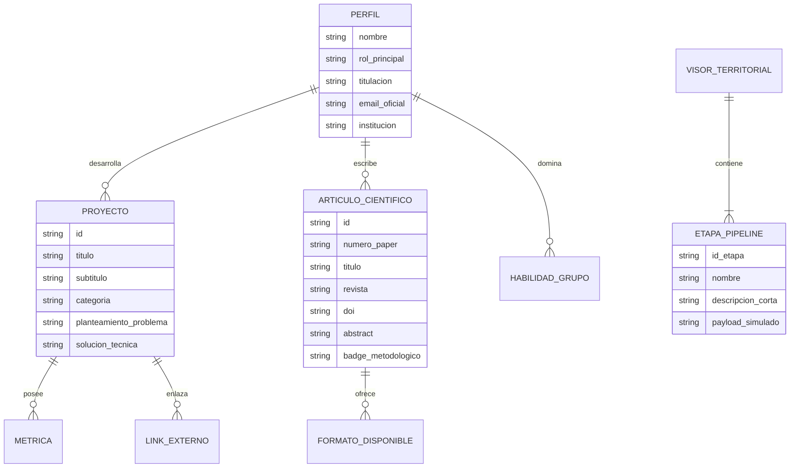

# Mapa de Entidades del Dominio (IEEE 830 / ISO 29148)
**Proyecto**: Portafolio Web Profesional e IHC  
**Autor**: Adán Y. Sánchez Cubillos  
**Versión**: 1.1.0  
**Fase PDCO**: PLAN  

---

## 1. Entidades Principales

---

## 2. Definición de Atributos y Reglas de Integridad

### 2.1 Entidad `ArticuloCientifico`
- `id`: Identificador único tipo string kebab-case (`paper-ipt-ocde`, `paper-moran-lisa`).
- `doi`: Identificador de objeto digital válido (formato `10.1016/...` o `10.1186/...`).
- `abstract`: Resumen científico no anémico con descripción del problema y aporte econométrico.
- `formats`: Lista de formatos soportados (`PDF`, `LaTeX`, `Typst`, `Markdown`, `BibTeX`).

### 2.2 Entidad `Proyecto`
- `id`: Identificador único.
- `metrics`: Colección de métricas auditadas con valor cuantitativo, etiqueta y descripción.
- `architecture`: Especificación de arquitectura y pasos del diagrama.
- `technologies`: Lista de lenguajes y librerías comprobadas.
