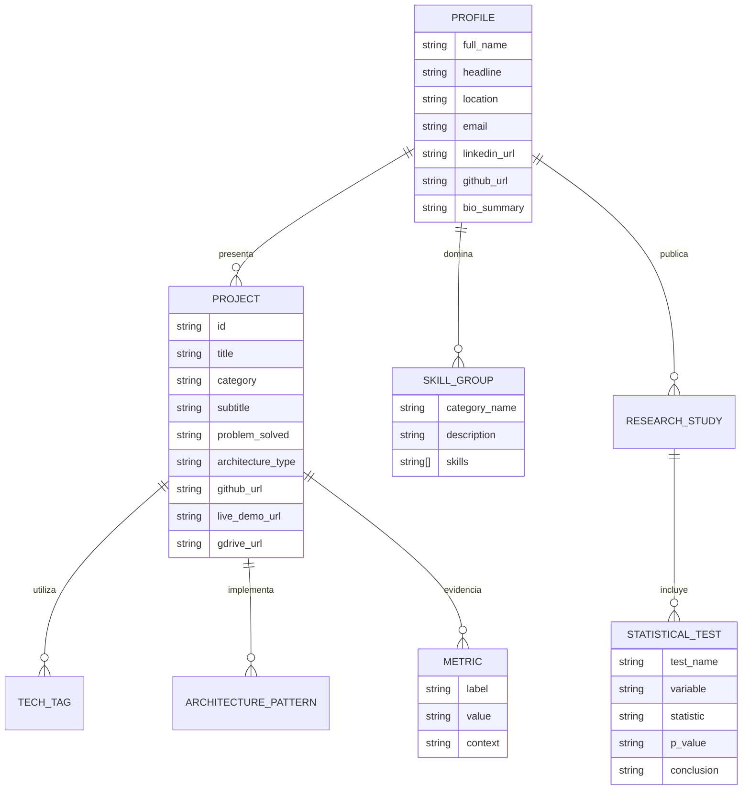

# Mapa de Entidades y Modelo Conceptual
**Proyecto**: Portafolio Web Profesional e IHC — Adán Sánchez  
**Fase PDCO**: PLAN $\rightarrow$ DEVELOPMENT  

---

## 1. Diagrama Entidad-Relación Conceptual (Mermaid)

---

## 2. Descripción de Entidades Principales

1. **Profile (Perfil Profesional)**: Contiene la identidad, propuesta de valor, biografía y canales de contacto de Adán Sánchez.
2. **Project (Proyecto Técnico)**: Representa los entregables mayores de software y ciencia de datos (SIPTA, Data Wrangling Bogotá, Dashboards Power BI, Java Enterprise).
3. **Metric (Métricas de Calidad e Impacto)**: Cuantificación verificable de resultados (volumen de datos, pruebas estadísticas, cobertura de código).
4. **SkillGroup (Grupo de Competencias)**: Clasificación de habilidades por disciplina (Data Science, Software Engineering, BI, IHC/UX).
5. **StatisticalTest (Pruebas de Inferencia)**: Registro de rigurosidad estadística en estudios empíricos.
