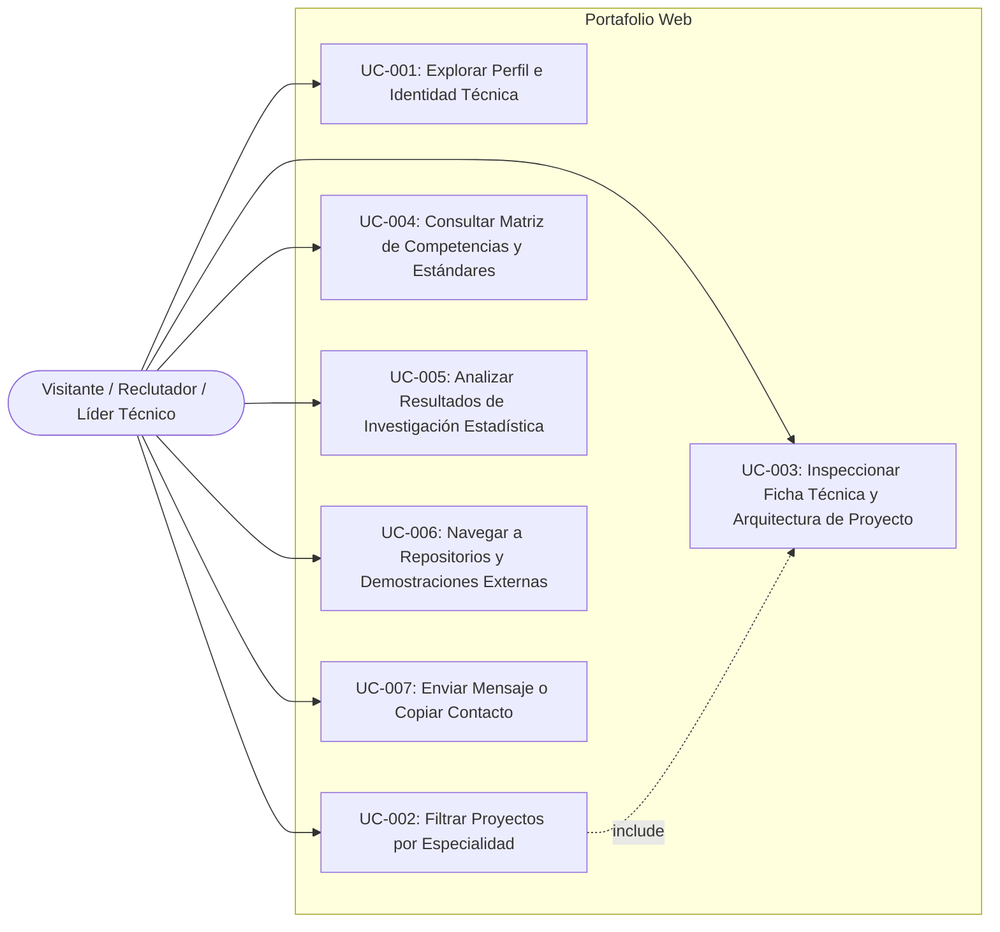

# Casos de Uso por Entidad (Use Cases Specification)
**Proyecto**: Portafolio Web Profesional e IHC — Adán Sánchez  
**Fase PDCO**: PLAN $\rightarrow$ DEVELOPMENT  

---

## 1. Diagrama General de Casos de Uso (Mermaid)

---

## 2. Detalle de Casos de Uso Principales

### UC-001: Explorar Perfil e Identidad Técnica
- **Actor**: Visitante / Evaluador Técnico.
- **Precondición**: Carga exitosa de la aplicación web.
- **Flujo Principal**:
  1. El usuario visualiza la sección Hero con la propuesta de valor y KPIs destacados (+1.04M registros, VIF 3.21, Moran's I 0.412, SOLID 100%).
  2. El usuario explora los pilares de ingeniería (SWEBOK, DAMA-BOK, ISO 25010, Clean Code).
- **Postcondición**: El usuario comprende la identidad profesional integral de Adán Sánchez.

### UC-002: Filtrar Proyectos por Especialidad
- **Actor**: Visitante.
- **Flujo Principal**:
  1. El usuario interactúa con la barra de filtros segmentados (*Todos*, *Data Science & GIS*, *ETL & Software Architecture*, *Power BI & Analytics*, *Inferencia Estadística*).
  2. El sistema actualiza fluidamente la cuadrícula de tarjetas mediante transiciones de opacidad y escala sin recargar la página.
- **Postcondición**: Se muestran únicamente los proyectos correspondientes a la categoría seleccionada.

### UC-003: Inspeccionar Ficha Técnica y Arquitectura de Proyecto
- **Actor**: Visitante / Reclutador Técnico.
- **Flujo Principal**:
  1. El usuario hace clic en el botón "Ver Ficha Técnica / Caso de Estudio" de una tarjeta de proyecto.
  2. El sistema abre un modal flotante con efecto *glassmorphism* que detalla:
     - Problema resuelto y contexto de negocio.
     - Diagrama de arquitectura del sistema / Flujo BPMN.
     - Patrones de diseño aplicados (GoF/GRASP).
     - Métricas empíricas de impacto y rigor metodológico.
     - Enlaces a código fuente en GitHub y demostraciones en vivo.
  3. El usuario puede cerrar el modal con tecla `Escape`, clic exterior o botón de cierre.
