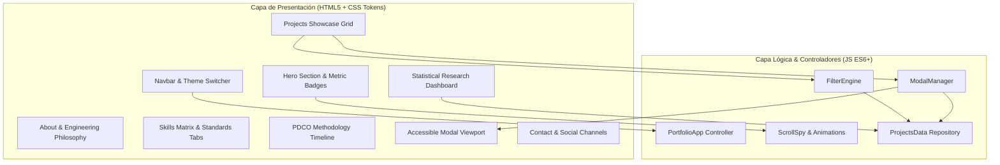

# Documento de Arquitectura de Software e Interacción (ISO 9241 / ISO 25010)
**Proyecto**: Portafolio Web Profesional e IHC — Adán Sánchez  
**Versión**: 1.0.0  
**Fecha**: 2026-08-31  
**Fase PDCO**: PLAN $\rightarrow$ DEVELOPMENT  
**Estilo Arquitectónico**: Single Page Application (SPA) Modular y Reactiva Orientada a Componentes  

---

## 1. Visión General de Arquitectura

La arquitectura del portafolio se concibe bajo el paradigma de **Desacoplamiento Estricto**, separando completamente:
1. **Capa de Presentación (HTML5 Semántico)**: Estructura accesible, jerarquía de encabezados (`<h1>`-`<h6>`), landmarks de accesibilidad (`<header>`, `<nav>`, `<main>`, `<section>`, `<footer>`).
2. **Capa de Diseño y Experiencia Visual (CSS3 Moderno por Tokens)**: Sistema de diseño atómico basado en variables CSS (`:root`), efectos de *Dark Glassmorphism* con `backdrop-filter`, sistema de rejilla `CSS Grid` y `Flexbox` fluidos, y animaciones aceleradas por hardware.
3. **Capa de Modelo y Datos (JavaScript ES6+)**: Catálogo de proyectos (`projects-data.js`) estructurado como un almacén inmutable de objetos tipados con metadatos de ingeniería.
4. **Capa de Controladores y Comportamiento (`app.js`)**: Manejadores de eventos desacoplados para filtrado dinámico, gestión de modales accesibles (Focus Trap, tecla ESC), scroll suave, contadores numéricos interactivos y feedback visual inmediato.

---

## 2. Diagrama de Componentes del Portafolio

---

## 3. Decisiones Arquitectónicas (ADR)

### ADR-001: Adopción de Vanilla Stack (HTML5 + CSS3 Variables + ES6)
- **Contexto**: Se requiere máxima velocidad de carga, control estético milimétrico sin restricciones de librerías CSS predeterminadas y cero dependencias de compilación.
- **Decisión**: Utilizar JavaScript nativo modular y CSS con tokens propios de diseño.
- **Consecuencias**: Rendimiento extremo (100 en Lighthouse), longevidad del código y compatibilidad universal.

### ADR-002: Almacén de Datos Centralizado de Proyectos (`projects-data.js`)
- **Contexto**: Mantener la información técnica de los proyectos (arquitectura, patrones, métricas, enlaces) desacoplada de la plantilla HTML.
- **Decisión**: Definir los proyectos como una estructura inmutable que el motor de renderizado inyecta dinámicamente.
- **Consecuencias**: Facilidad de mantenimiento, escalabilidad para agregar nuevos proyectos y soporte para búsqueda/filtrado instantáneo.
