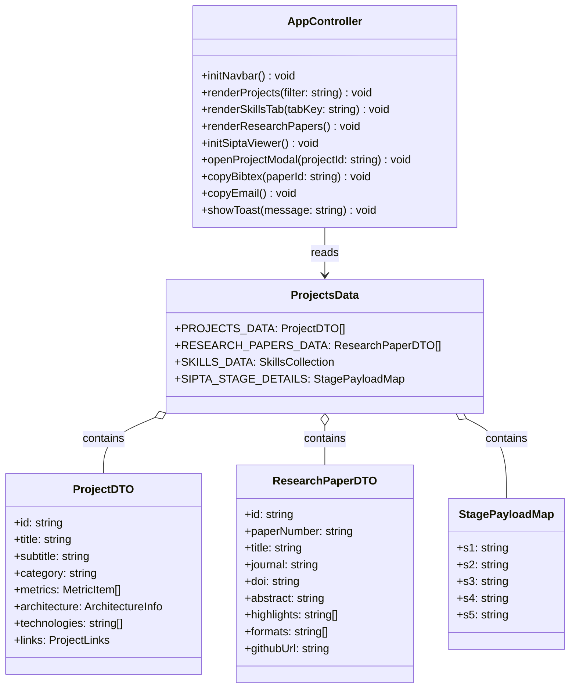

# Diagrama de Clases / Módulos de Frontend (Mermaid)
**Fase PDCO**: DEVELOPMENT | **Estándar**: UML 2.5 / SWEBOK v3

```mermaid
classDiagram
    class AppController {
        +initNavbar() void
        +renderProjects(filter: string) void
        +renderSkillsTab(tabKey: string) void
        +renderResearchPapers() void
        +initSiptaViewer() void
        +openProjectModal(projectId: string) void
        +copyBibtex(paperId: string) void
        +copyEmail() void
        +showToast(message: string) void
    }

    class ProjectsData {
        +PROJECTS_DATA: ProjectDTO[]
        +RESEARCH_PAPERS_DATA: ResearchPaperDTO[]
        +SKILLS_DATA: SkillsCollection
        +SIPTA_STAGE_DETAILS: StagePayloadMap
    }

    class ProjectDTO {
        +id: string
        +title: string
        +subtitle: string
        +category: string
        +metrics: MetricItem[]
        +architecture: ArchitectureInfo
        +technologies: string[]
        +links: ProjectLinks
    }

    class ResearchPaperDTO {
        +id: string
        +paperNumber: string
        +title: string
        +journal: string
        +doi: string
        +abstract: string
        +highlights: string[]
        +formats: string[]
        +githubUrl: string
    }

    class StagePayloadMap {
        +s1: string
        +s2: string
        +s3: string
        +s4: string
        +s5: string
    }

    AppController --> ProjectsData : reads
    ProjectsData o-- ProjectDTO : contains
    ProjectsData o-- ResearchPaperDTO : contains
    ProjectsData o-- StagePayloadMap : contains
```
