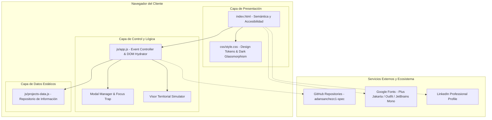

# Diagrama de Componentes del Sistema (Mermaid)
**Fase PDCO**: DEVELOPMENT | **Estándar**: UML 2.5 / ISO 42010

```mermaid
graph TB
    subgraph Navegador del Cliente
        subgraph Capa de Presentación
            HTML[index.html - Semántica y Accesibilidad]
            CSS[css/style.css - Design Tokens & Dark Glassmorphism]
        end

        subgraph Capa de Control y Lógica
            APP[js/app.js - Event Controller & DOM Hydrator]
            MODAL[Modal Manager & Focus Trap]
            BPMN[Visor Territorial Simulator]
        end

        subgraph Capa de Datos Estáticos
            DATA[js/projects-data.js - Repositorio de Información]
        end
    end

    subgraph Servicios Externos y Ecosistema
        GH[GitHub Repositories - adansanchezc1-spec]
        GF[Google Fonts - Plus Jakarta / Outfit / JetBrains Mono]
        LI[LinkedIn Professional Profile]
    end

    HTML --> CSS
    HTML --> APP
    APP --> MODAL
    APP --> BPMN
    APP --> DATA
    
    HTML -.-> GF
    APP -.-> GH
    HTML -.-> LI
```
