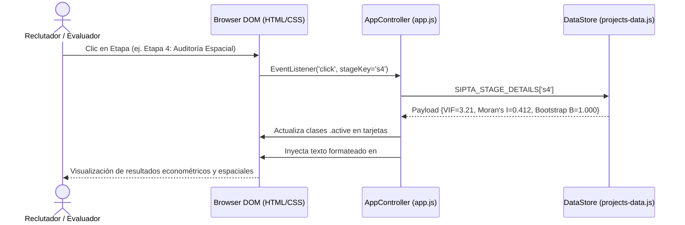

# Diagrama de Secuencia — Interacción con Visor Territorial SIPTA (Mermaid)
**Fase PDCO**: DEVELOPMENT | **Estándar**: UML 2.5

```mermaid
sequenceDiagram
    actor Usuario as Reclutador / Evaluador
    participant UI as Browser DOM (HTML/CSS)
    participant Ctrl as AppController (app.js)
    participant Data as DataStore (projects-data.js)

    Usuario->>UI: Clic en Etapa (ej. Etapa 4: Auditoría Espacial)
    UI->>Ctrl: EventListener('click', stageKey='s4')
    Ctrl->>Data: SIPTA_STAGE_DETAILS['s4']
    Data-->>Ctrl: Payload {VIF=3.21, Moran's I=0.412, Bootstrap B=1.000}
    Ctrl->>UI: Actualiza clases .active en tarjetas
    Ctrl->>UI: Inyecta texto formateado en #viewerTerminalPreview
    UI-->>Usuario: Visualización de resultados econométricos y espaciales
```
